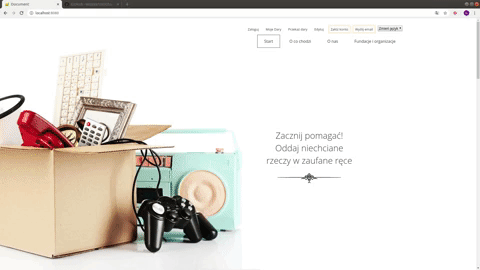

# Przekazanie darów

Projekt portalu, dzięki któremu można przekazać dary potrzebującym.

Elementy:
- formularz logowania , rejestracji, przekazania darów
- zapisywanie do bazy danych informacji o darach, użytkownikach
- zarządzani użytkownikami i instytucjami

Użyte technologie:
- java
- spring boot
- spring security
- hibernate
- HTML
- Javascript

# Główna strona

# Rejestracja oraz logowanie z aktywacją mailową konta na portalu.

# Panel Admina

# Formularz przekazania darów

